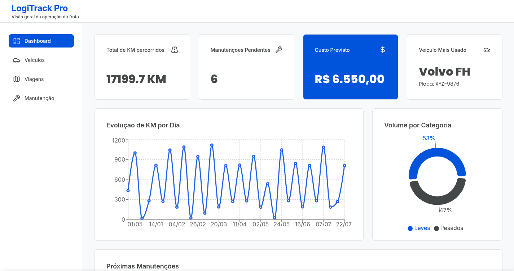
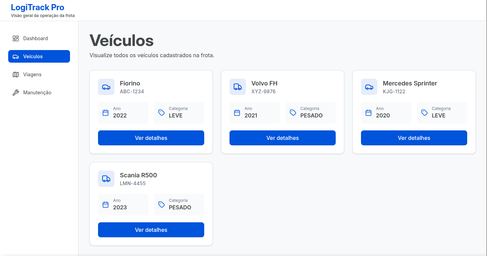
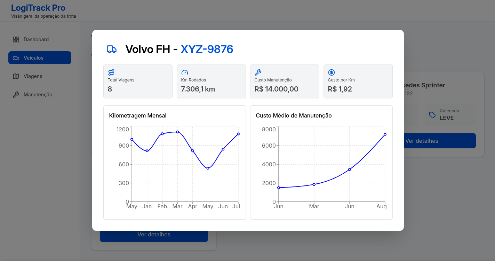
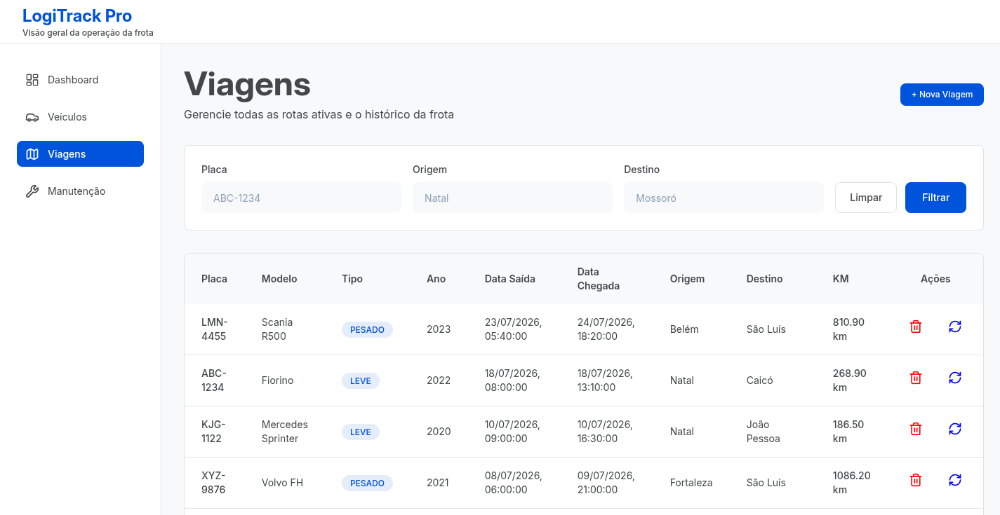
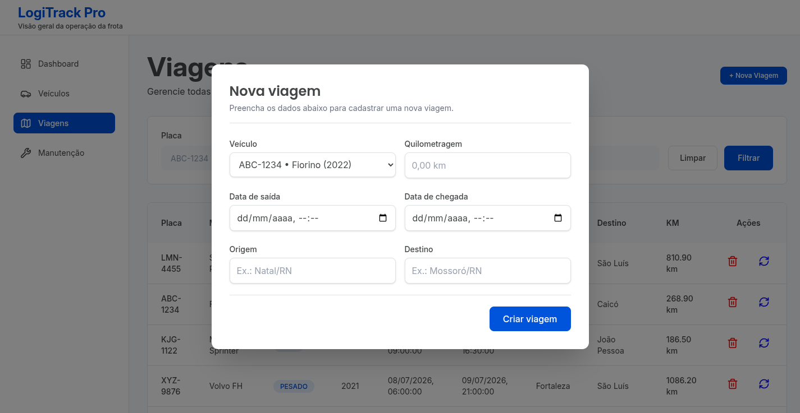
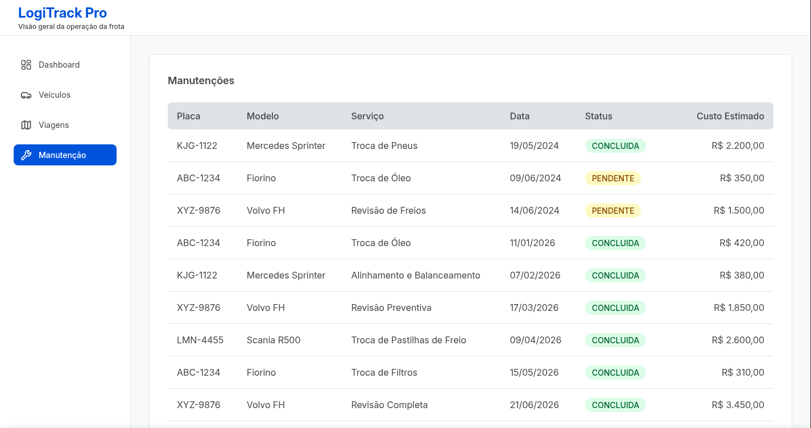

# 🚚 LogiTrack Pro

Sistema web para **gerenciamento de frota logística e análise operacional**, desenvolvido como MVP para centralizar informações de veículos, viagens e manutenções.

A aplicação permite acompanhar a utilização da frota através de um **dashboard analítico**, fornecendo indicadores estratégicos para apoio à tomada de decisão.

---

# 🎨 Protótipo da Interface

O design inicial da aplicação foi desenvolvido no Figma, contendo os principais fluxos e telas do sistema.

- **Acessar protótipo no Figma:** https://www.figma.com/design/y0dLNS7EfWtbKMiQTougpR/LogiTrack-Pro?m=auto&t=qyjs97pd2h3IcYg4-1

---

# 🌐 Deploy

- **Frontend:** https://logitrack-pro-lyart.vercel.app/
- **Backend API:** https://logitrack-pro-1sp1.onrender.com/

---

# 📸 Demonstração da Aplicação

## 📊 Dashboard

Visão geral dos principais indicadores operacionais da frota:



---

## 🚘 Gestão de Veículos

Listagem dos veículos cadastrados:



Detalhamento individual do veículo com indicadores e gráficos:



---

## 🛣️ Gestão de Viagens

Visualização das viagens realizadas:



Cadastro de uma nova viagem:



---

## 🔧 Gestão de Manutenções

Consulta das manutenções cadastradas:



---

# 🎯 Objetivo

O projeto foi desenvolvido com o objetivo de substituir controles descentralizados em planilhas por uma aplicação web capaz de:

- Registrar operações da frota.
- Centralizar informações de veículos, viagens e manutenções.
- Disponibilizar indicadores operacionais.
- Auxiliar gestores através de consultas analíticas.

O sistema permite o acompanhamento da utilização dos veículos, controle de manutenção e análise de desempenho da frota.

---

# 📋 Planejamento do Desenvolvimento

O desenvolvimento foi organizado utilizando **GitHub Projects**, onde as funcionalidades foram descritas como histórias de usuário e acompanhadas através de um fluxo Kanban.

O quadro contém:

- 📝 Histórias de usuário.
- 📌 Organização das tarefas por etapa.
- 📈 Acompanhamento de progresso.
- ✅ Controle das funcionalidades concluídas.

Acesse o quadro:

➡️ [Kanban do Projeto - GitHub Projects](https://github.com/users/IsaacLira42/projects/6)

---

# 📚 Documentação

Além do código-fonte, o projeto possui documentação complementar sobre arquitetura, decisões técnicas e modelagem do sistema.

## Documentos disponíveis

- 🏗️ [Arquitetura do Sistema](./docs/arquitetura.md)  
  Explica a organização do backend, frontend, fluxo de comunicação e responsabilidades das camadas.

- 🧠 [Decisões Técnicas](./docs/decisoes-tecnicas.md)  
  Documenta escolhas realizadas durante o desenvolvimento, incluindo modelagem do banco, DTOs, Projections, SQL nativo e estratégias adotadas.

- 🗄️ [Modelo de Banco de Dados](./docs/banco/V2/)  
  Contém DER atualizado, scripts de criação e documentação das alterações realizadas em relação ao banco inicial.

- 👥 [Histórias de Usuário](./docs/user-stories.md)  
  Apresenta as funcionalidades do sistema sob a perspectiva dos usuários.

---

# ✨ Funcionalidades

## 🛣️ Gestão de Viagens

Permite controlar todo o ciclo de registro das viagens realizadas.

Funcionalidades:

- Cadastro de viagens.
- Atualização de registros.
- Exclusão de viagens.
- Listagem de viagens cadastradas.
- Filtros por:
  - 🚘 Placa do veículo.
  - 📍 Origem.
  - 📍 Destino.

---

## 🚘 Gestão de Veículos

Permite consultar informações e indicadores individuais de cada veículo.

Funcionalidades:

- Listagem dos veículos cadastrados.
- Visualização detalhada do veículo.
- Indicadores individuais:
  - Quantidade de viagens realizadas.
  - Quilometragem acumulada.
  - Custos de manutenção.
  - Custo médio por quilômetro.

### 📈 Gráficos disponíveis:

- Evolução mensal de quilometragem.
- Custo médio de manutenção.

---

## 🔧 Gestão de Manutenções

Permite acompanhar os serviços realizados na frota.

Funcionalidades:

- Visualização das manutenções cadastradas.
- Consulta dos serviços realizados.
- Consulta dos custos associados.

---

# 📊 Dashboard Analítico

O dashboard apresenta indicadores extraídos diretamente do banco de dados.

Métricas disponíveis:

- 🚚 Total de KM percorrido pela frota.
- 📊 Volume de viagens por categoria de veículo (Leve/Pesado).
- 🔧 Próximas manutenções agendadas.
- 🏆 Ranking de utilização dos veículos.
- 💰 Projeção financeira de manutenção.
- ⚠️ Manutenções pendentes.
- 📈 Evolução de quilometragem por dia.

As métricas utilizam consultas SQL específicas para operações de:

- Agregação.
- Agrupamento.
- Análise de dados.

---

# 🛠️ Tecnologias Utilizadas

## Backend

- Java 25.
- Spring Boot 4.0.7.
- Spring Data JPA.
- PostgreSQL.
- Flyway.
- Maven.

---

## Frontend

- React 19.2.7.
- TypeScript 6.0.2.
- Vite 8.1.1.
- Tailwind CSS 4.3.3.
- TanStack React Query.
- Axios.
- React Hook Form.
- Zod.
- Recharts.
- React Router.

---

## Infraestrutura

- Docker.
- Docker Compose.
- PostgreSQL 17.

---

# 🏗️ Arquitetura

## Backend

O backend segue uma arquitetura em camadas:

```

Controller
    |
Service
    |
Repository
    |
Database

```

### Responsabilidades

- **Controller:** exposição dos endpoints REST.
- **Service:** regras de negócio e orquestração.
- **Repository:** comunicação com o banco de dados.
- **DTOs:** transferência controlada de informações.
- **Mapper:** conversão entre entidades e objetos de resposta.
- **Projection:** retorno otimizado para consultas analíticas.

---

## Frontend

A aplicação frontend utiliza organização baseada em funcionalidades:

```

features/
├── dashboard
├── viagens
├── veiculos
└── manutencoes

```

Cada módulo possui seus próprios:

- Componentes.
- Hooks.
- Serviços.
- Tipagens.

---

# 📂 Estrutura do Projeto

```

LogiTrack-Pro
├── backend
│ ├── controller
│ ├── service
│ ├── repository
│ ├── dto
│ ├── model
│ └── projection
│
├── frontend
│ ├── components
│ ├── features
│ ├── hooks
│ └── services
│
├── docs
│
└── docker-compose.yml

```

---

# 🗄️ Banco de Dados

O banco utilizado é o **PostgreSQL**.

O gerenciamento do schema é realizado através do **Flyway**, garantindo versionamento e rastreabilidade das alterações.

A aplicação utiliza:

```properties
spring.jpa.hibernate.ddl-auto=validate
```

Dessa forma:

- O Hibernate apenas valida o modelo existente.
- Alterações estruturais são controladas pelas migrations.
- O banco permanece sincronizado com o código.

As alterações realizadas no modelo inicial estão documentadas em:

```
docs/banco/V2
```

---

# 🚀 Como Executar Localmente

## Pré-requisitos

Necessário possuir:

- Docker.
- Docker Compose.

---

## Executar aplicação completa

Na raiz do projeto:

```bash
docker compose up --build
```

Serviços iniciados:

### Frontend

```
http://localhost:5173
```

### Backend

```
http://localhost:8080
```

### Banco de Dados

```
PostgreSQL
localhost:5432
```

---

# 📖 Documentação da API

A API possui documentação interativa utilizando **Swagger/OpenAPI**.

## Ambiente local

Após iniciar o backend, acessar:

```
http://localhost:8080/swagger-ui/index.html
```

---

# 🧠 Decisões Técnicas

## 🛣️ Escolha do módulo de viagens

O módulo de viagens foi escolhido como principal CRUD porque possui relação direta com grande parte das métricas utilizadas no dashboard.

---

## 📦 Uso de DTOs

As entidades JPA não são expostas diretamente pela API.

Foram utilizados DTOs para:

- Controlar dados enviados e recebidos.
- Evitar exposição da estrutura interna das entidades.
- Melhorar organização da comunicação entre camadas.

---

## 🧮 Uso de SQL nas métricas

As consultas analíticas foram implementadas utilizando SQL específico para operações como:

- SUM.
- COUNT.
- GROUP BY.
- Ordenações.
- Agregações.

---

## 🔢 Uso de Enum

Campos como:

- Tipo de veículo.
- Status de manutenção.

Utilizam enums para reduzir inconsistências nos valores armazenados.

---

# 📄 Documentação Adicional

Estrutura dos documentos complementares:

```
docs/
├── banco
├── arquitetura.md
├── decisoes-tecnicas.md
└── user-stories.md
```

Incluindo:

- Modelo de dados.
- Alterações realizadas no banco.
- Histórias de usuário.
- Decisões arquiteturais.

---

# 🔮 Melhorias Futuras

Possíveis evoluções do sistema:

- 🔐 Autenticação e autorização de usuários.
- 👥 Controle de permissões por perfil.
- 🧪 Testes automatizados.
- 📄 Paginação avançada.
- 📊 Relatórios exportáveis.
